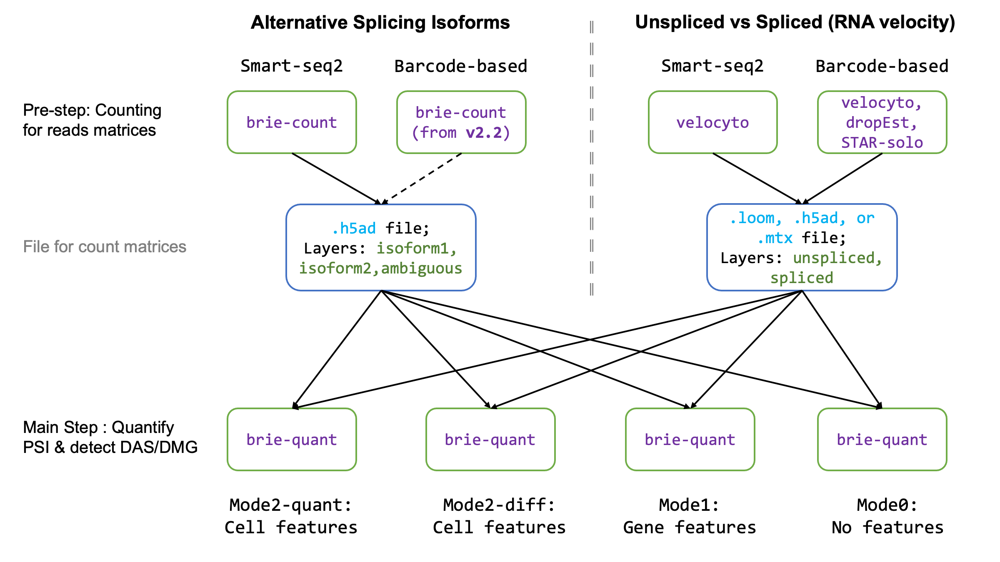

===========
Quick start
===========

BRIE2 estimates the splicing proportion for two-component events across many 
cells. It is designed for analysing two molecular levels of splicing processes:

1. Alternative splicing isoforms, e.g., exon included or excluded. BRIE2 will 
   identify differential alternative splicing (DAS) events. 
   See demo1_ for detecting DAS between disease and control.

2. Spliced vs unspliced RNAs for RNA velocity analysis. BRIE2 will identify 
   differential momentum genes (DMG).
   See demo2_ for detecting DMG between cell types.

For getting started quickly, there are two steps to go: **counting** and 
**quantifying**. 
The ``brie-quant`` (for quantifying and testing) is developed in a unified 
manner. Here we provide a roadmap of using BRIE2 for both molecular levels 
in different purposes (quantification or feature detection).

.. _demo1: https://github.com/huangyh09/brie-tutorials/blob/main/msEAE/run_brie2.sh
.. _demo2: https://github.com/huangyh09/brie-tutorials/blob/main/scNTseq/run_brie2.sh

Pre-step: read counting
-----------------------

First, you need to count the isoform-specific reads in each splicing event in 
each cell. Similarly for read/UMI counts for spliced and unspliced RNAs. BRIE2
only provides a utility function for read counts in alternative splicing. For 
counting spliced/unspliced reads, we provide some tips in the 
`unspliced RNA counting <#others-for-unspliced-rna-counting>`_ section.

For alternative splicing, e.g., exon-skipping event, you can download 
the splicing `annotations`_ generated by us or make your own, e.g., with 
`briekit`_.

Then you can use the ``brie-count`` to fetch the read count tensor, which will 
be stored in hdf5 format as `AnnData`_. See more details on `brie-count 
CLI <brie_count.html>`_, and you can use this example command line.

.. code-block:: bash

  # for smart-seq
  brie-count -a AS_events/SE.gold.gtf -S sam_and_cellID.tsv -o out_dir -p 15

  # for droplet, e.g. 10x Genomics
  brie-count -a AS_events/SE.gold.gtf -s possorted.bam -b barcodes.tsv.gz -o out_dir -p 15
  
.. _annotations: https://sourceforge.net/projects/brie-rna/files/annotation
.. _briekit: https://github.com/huangyh09/briekit/wiki
.. _AnnData: https://anndata.readthedocs.io

Besides the SE event, other types of alternative splicing, e.g., intron 
retaining is also applicable with BRIE. Some pre-processing utilities will be 
available soon.

Main Step: quantify and detect
------------------------------

``brie-quant`` is used for this step. If GPU is available, we highly 
recommend using GPU for ~10x speedup comparing CPU server. Thanks to good 
support from Tensorflow, the environment setting is straightforward, see our 
guide on `GPU Usage <./install.html#gpu-usage>`_.

This step supports various settings for either quantification of splicing or 
detection of splicing phenotypes. You can directly run step 1.2 if you only want
to perform phenotype detection.

PSI quantification
~~~~~~~~~~~~~~~~~~

You can quantify the isoform with cell or gene features or both or none. Usually,
we recommend using aggregated imputation even if you don't have any feature, 
namely ``mode2-quant`` in `brie-quant CLI <brie_quant.html>`_ as follows (please add 
``--interceptMode gene`` for aggregating cells as prior for each gene),

.. code-block:: bash

  brie-quant -i out_dir/brie_count.h5ad -o out_dir/brie_quant_aggr.h5ad --interceptMode gene

Splicing Phenotype detection
~~~~~~~~~~~~~~~~~~~~~~~~~~~~

If you have cell-level features, e.g., disease condition or cell type or 
continuous variable, you can use it in cell features to detect variable splicing
events or differential momentum genes as phenotypes for further analysis. This 
is ``mode2-diff`` in `brie-quant CLI <brie_quant.html>`_, so requires ``-c`` and 
``--LRTindex``.

.. code-block:: bash

  brie-quant -i out_dir/brie_count.h5ad -o out_dir/brie_quant_cell.h5ad \
      -c $DATA_DIR/cell_info.tsv --interceptMode gene --LRTindex=All

**Example**

Please see the example in 
`brie-quant CLI mode 3 <brie_quant.html#mode2-diff-variable-splicing-detection>`_,
and 
`MS data <brie2_msEAE.html#BRIE2-option-1:-differential-splicing-events>`_.

Downstream Step: analysis
-------------------------

The BRIE output AnnData files are compatible with `Scanpy`_, hence you can 
easily use it for dimension reduction, clustering, and other visualization. 
A few examples for both alternative splicing and RNA velocity are also available
in this documentation (see the navigation bar on the left).

.. _Scanpy: https://scanpy.readthedocs.io

Others for unspliced RNA counting
---------------------------------

BRIE2 doesn't provide a utility function for counting the spliced and unspliced 
RNAs, but thanks to the community efforts, there are a few tools already 
available for this purpose:

1. `velocyto.py`_: the earliest software for this purpose. Generally not  
   computationally efficient, possible due to written in Python. For unknown 
   reasons, the proportion of unspliced RNA is unrealistically high for 5' 
   scRNA-seq data based on 10x Genomics.

2. dropEst_: as implemented in C/C++, it is much more efficient. It also 
   returns more reasonable proportions of unspliced RNAs for 5' 10x Genomics data

3. STAR-solo_: new extension for the popular STAR. Benefits: efficient and one 
   step for reads alignment and counting of unspliced RNA (Recommended option)

The first two options take inputs as aligned bam file(s), and STAR-solo_ itself
is a widely used aligner and provides the count matrices directly. All these 
options align reads to genome and define reads as unspliced and spliced by the 
gene annotations in GTF/GFF3 format.

Alternatively, there are other options by aligning reads to annotated 
transcriptomes directly e.g., `kallisto bustools`_.
However, the agreement of the above counting tools is still not perfect 
according to a recent benchmarking paper 
(`Soneson et al, Plos Comp Bio, 2021 <https://doi.org/10.1371/journal.pcbi.1008585>`_)

.. _velocyto.py: http://velocyto.org/velocyto.py/tutorial/cli.html
.. _dropEst: https://dropest.readthedocs.io/en/latest/dropest.html
.. _STAR-solo: https://github.com/alexdobin/STAR/blob/master/docs/STARsolo.md
.. _kallisto bustools: https://www.kallistobus.tools/
